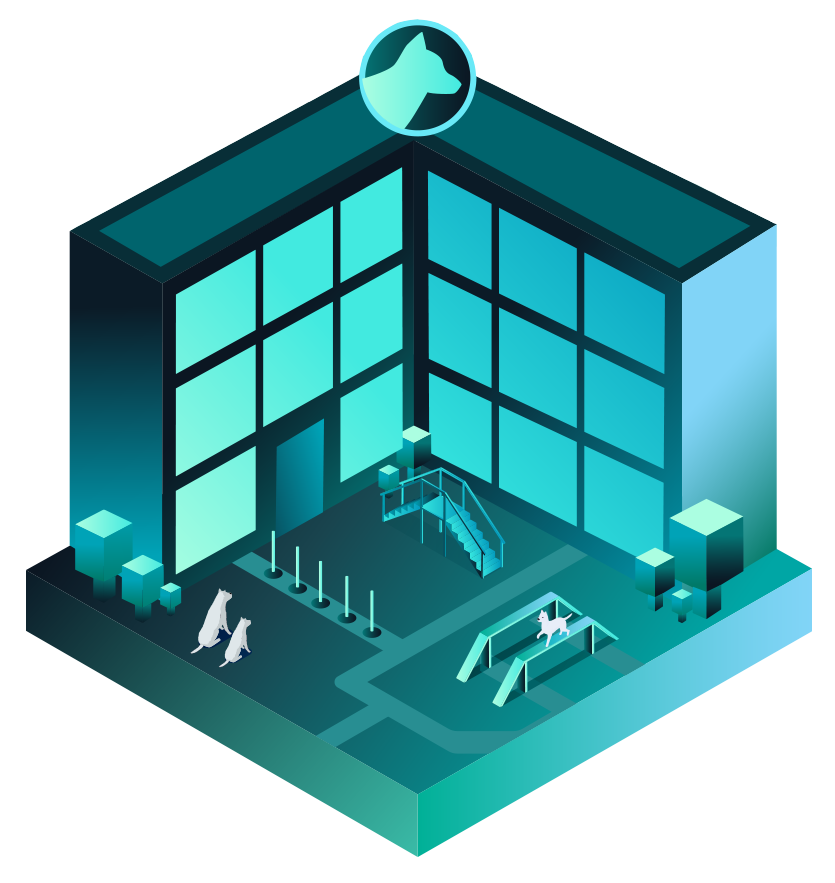

# Тренировочный зал

В тренировочном зале вы можете дрессировать своих собак. Стимулируйте их потенциал, чтобы стать великими гонщиками, пройдя курсы обучения, чтобы повысить их характеристики. После каждой тренировки скорость, выносливость и физическая форма борзой будут увеличиваться. Если вам посчастливилось владеть умной собакой, её характеристики могут быть удвоены.

После каждой успешной тренировки характеристики гоночной собаки увеличиваются на 0,05% всех атрибутов (2% бонусной ставки напрямую увеличивает атрибуты на 0,1% ). До 20% дополнительной статистики.
