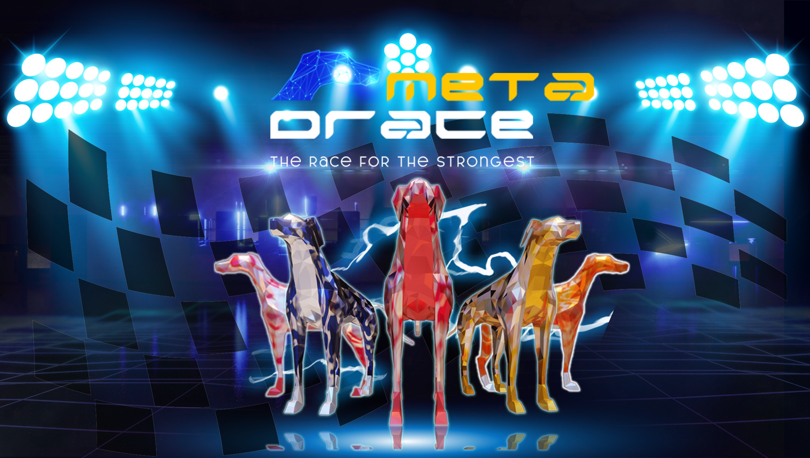

# Забеги

* В каждом забеге участвует от 6 до 8 борзых.
* Каждая собака имеет от 60 до 100 очков силы в зависимости от редкости.
* Каждая гонка стоит 20 очков силы. Чем выше количество звезд, тем больше физическая сила борзой (максимум 100 очков). Игроки также могут улучшить физическую форму гоночной собаки, ежедневно тренируя ее.
* Когда у собаки заканчивается энергия, она не может продолжать гонку и нуждается в отдыхе, чтобы восстановить свою физическую форму. Через каждые 24 часа собаку нужно кормить, чтобы она могла продолжать гонку.
* Победители награждаются токенами **$DRACE**
* Кроме того, игроки могут присоединиться к режиму PVP MetaDrace с друзьями или другими игроками. Игроки могут присоединиться к существующей комнате или создать новую комнату для игры. Создатель комнаты определит лучшего в игре. Проигравший будет исключен после раундов. Приз делится между победителями.
